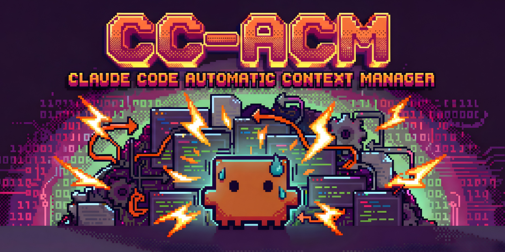

# CC-ACM (Claude Code Automatic Context Manager)

Automatic context handoff for Claude Code. When your session hits 60% context usage, a dialog prompts you to generate a summary and open a fresh session with full context.

## Features

- **Auto-trigger at 60%** - Statusline monitors context usage
- **Yes / In 5 min / Dismiss** - Snooze support for when you're mid-task
- **Seamless handoff** - Summary generated via `claude -p`, new tab opens with `--append-system-prompt`
- **Dark themed UI** - Matches Claude/terminal aesthetic

## How It Works

```
Statusline (every 300ms)
    │
    └─ at 60% → handoff-prompt.sh
                    │
                    ├─ [Handoff] → claude -p generates summary → new tab opens
                    ├─ [In 5 min] → snooze, asks again later
                    └─ [Dismiss] → won't ask again this session
```

## Installation

```bash
# Run the install script
./install.sh
```

This will:
1. Copy scripts to `~/.claude/scripts/`
2. Update your statusline to trigger at 60%
3. Back up existing files

## Manual Installation

1. Copy `scripts/handoff-prompt.sh` to `~/.claude/scripts/`
2. Make executable: `chmod +x ~/.claude/scripts/handoff-prompt.sh`
3. Add the trigger logic to your statusline (see `statusline-patch.sh`)

## Files

```
scripts/
├── handoff-prompt.sh   # Main script: dialog + handoff flow
└── statusline-patch.sh # Patch for ~/.claude/statusline-command.sh
```

## Configuration

Edit `handoff-prompt.sh` to customise:
- **Threshold** - Change from 60% (in statusline)
- **Snooze duration** - Default 5 minutes (300 seconds)
- **Summary length** - Default 500 tokens

## Requirements (WSL/Warp - Default)

- Claude Code CLI
- WSL with Warp terminal (uses PowerShell for dialogs)
- Python 3 (for transcript parsing)

## Platform Variants

The default version is for WSL + Warp. Experimental versions for other platforms:

| Platform | Dialog | New Tab | Status |
|----------|--------|---------|--------|
| **WSL/Warp** (default) | PowerShell/WinForms | Warp keystrokes | Tested |
| [Linux (Zenity)](platforms/linux-zenity/) | Zenity GTK | gnome-terminal | Experimental |
| [macOS](platforms/macos/) | osascript | iTerm2/Terminal | Experimental |
| [Generic](platforms/generic/) | Text prompt | Manual | Experimental |

To use an experimental version, copy the `handoff-prompt.sh` from the relevant `platforms/` folder instead of the default one.

## License

MIT
